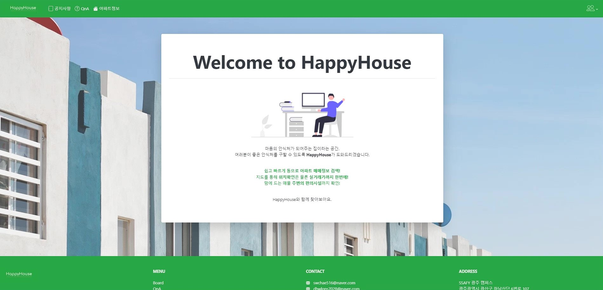
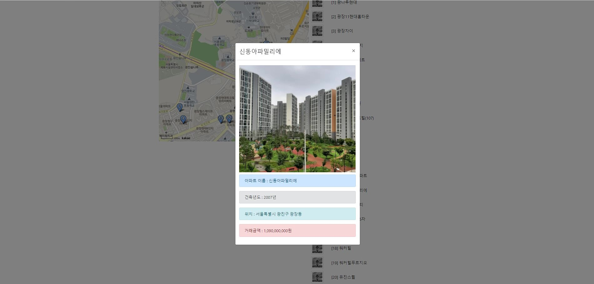

# 🏙 find_your_home
'Find your home'은 아파트 실거래가와 위치 정보를 제공하여 내 집 마련에 도움을 주는 서비스입니다.

## 프로젝트 기간
2021.11.17(수) ~ 2021.11.26(금) (1주)

## 팀원 및 역할 분담
- 오지훈: 아파트 매매 정보 관련 백엔드, 프론트엔드 구현.
- 이현정: UI/UX 디자인, 질문 게시판 · 관리자 계정 관련 백엔드, 프론트엔드 구현.
- 채성원: 회원관리 · 공지사항 및 댓글 백엔드, 프론트엔드 구현. 페이징, 검색 기능 구현.

## 기술 스택
- Frontend
  - Vue.js
  - Bootstrap
- Backend
  - Spring Boot
  - MySQL

## 핵심 기능
- User
  - 회원가입 · 탈퇴
  - 로그인 · 로그아웃
  - 비밀번호 찾기
  - 내 정보 페이지 · 수정
- Admin
  - 회원 목록
  - 회원 등록
  - 수정 및 삭제 권한
- Board
  - 공지사항
  - 질문 게시판
- Apt
  - 선택한 지역에 따른 아파트 실거래가를 지도에 마커로 표시하여 제공
  - 마커 선택 시, 아파트 세부정보가 나타남

## Installation
- Frontend
``` 
$ npm install
``` 

```
$ npm run server
```

## 기능 구현
#### 메인 페이지


#### 아파트 리스트


#### 아파트 세부


#### 회원가입


#### 로그인


#### 내 정보 수정


#### 비밀번호 수정


#### 공지사항


#### 질문 게시판


#### 회원 탈퇴


## 보고서

